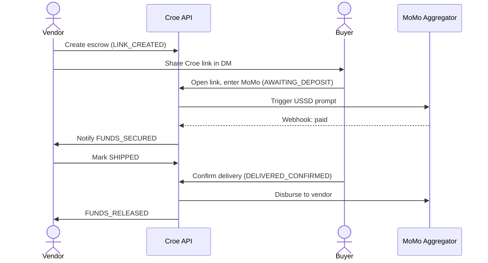
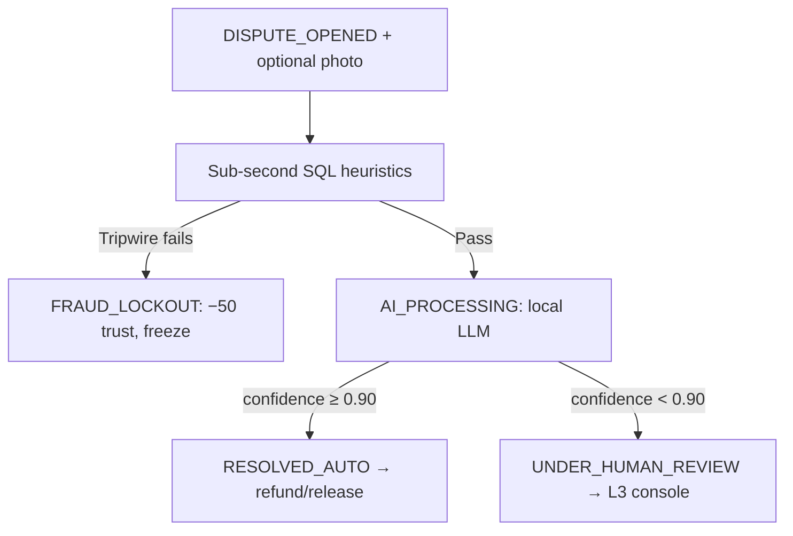

# Croe — Product Requirements Document (`01-PRD.md`)

> Terms in `code font` are defined in [`26-Glossary.md`](26-Glossary.md). Money handling follows the custody phases (P0–P3) defined there.

## 1. Executive Summary & Vision

**Croe** is a lightweight, mobile-first trust and escrow service for informal social commerce across emerging markets (WhatsApp, Instagram DMs, TikTok, Facebook Marketplace), launching **Ghana-first with a globally-extensible architecture**.

Social commerce suffers a structural trust deficit:
- **Buyers** fear paying upfront for goods that never arrive or arrive defective/counterfeit.
- **Vendors** fear dispatching inventory for orders where payment never materializes.

**Croe's solution:** a zero-friction payment-link system integrated with local **Mobile Money (MoMo)** rails. A buyer's funds are held in escrow until delivery is verified; then the vendor is paid out (less commission). Croe does not legally custody funds directly — it orchestrates a licensed custody chain per the phased-custody model (see [`06-Money-Custody-and-Settlement.md`](06-Money-Custody-and-Settlement.md)).

To operate sustainably without a large support team, disputes flow through a **Three-Tier Forensic & Automated Triage Pipeline**:
1. **Immutable forensic logging** — cryptographically verifiable audit trails and file hashing.
2. **Deterministic SQL heuristics** — sub-second automated tripwires for high-velocity fraud and Sybil attacks.
3. **Local AI dispute arbitrator** — a self-hosted open-weights LLM producing structured JSON decisions, escalating only genuinely ambiguous cases to a `Human Reviewer (L3)`.

## 2. Target Personas

### 2.1 The Vendor ("The Merchant")
- **Profile:** small-to-medium social seller on WhatsApp/Instagram.
- **Pain points:** cash-on-delivery rejections, fake payment receipts, time lost to trust-haggling.
- **Goals:** generate instant checkout links, get notified the moment funds are secured, receive guaranteed automated payout on delivery.

### 2.2 The Buyer ("The Consumer")
- **Profile:** mobile-first shopper buying clothes, electronics, lifestyle goods via DM.
- **Pain points:** fear of being scammed after sending a MoMo transfer upfront.
- **Goals:** pay securely via familiar MoMo USSD prompts, inspect goods on arrival, release funds instantly or file a structured dispute.

### 2.3 The Human Reviewer ("L3 Escalation")
- **Profile:** trust-and-safety / compliance officer.
- **Goals:** access complete forensic logs, IP/device metadata, SHA-256-verified media, and AI reasoning to adjudicate inconclusive disputes in minutes.

## 3. Core Functional Requirements

### 3.1 Escrow link generation
- **REQ-LINK-1:** Vendors create an escrow contract specifying item description, amount (`NUMERIC(15,2)`), currency (`GHS`/`NGN`/`KES`), and delivery terms → state `LINK_CREATED`.
- **REQ-LINK-2:** The system outputs a shareable Croe deep-link rendering as a rich preview card in chat apps (OpenGraph).

### 3.2 MoMo deposit & escrow locking
- **REQ-PAY-1:** Buyers entering a link provide MoMo number + carrier → state `AWAITING_DEPOSIT`.
- **REQ-PAY-2:** The backend triggers a carrier USSD prompt via the `Payment Aggregator`.
- **REQ-PAY-3:** On webhook confirmation, the contract transitions to `FUNDS_SECURED` (ledger event `FUNDS_DEPOSITED`) and both parties are notified.

### 3.3 Dispatch & delivery confirmation
- **REQ-DEL-1:** Vendors may mark `SHIPPED` only after `FUNDS_SECURED`.
- **REQ-DEL-2:** Buyers confirm delivery (idempotent request) → `DELIVERED_CONFIRMED` → payout → `FUNDS_RELEASED` (less commission).

### 3.4 Dispute submission & triage
- **REQ-DIS-1:** Either party may open a dispute within the dispute window (default 24h post-`SHIPPED`/delivery flag) → `DISPUTE_OPENED`.
- **REQ-DIS-2:** Disputes require a `reason_code` and optional media.
- **REQ-DIS-3:** Uploaded media is SHA-256-hashed on the fly and checked against history to detect recycled scam photos.
- **REQ-DIS-4:** Disputes passing deterministic checks are evaluated by the AI arbitrator, which outputs `REFUND_BUYER` / `RELEASE_VENDOR` / `ESCALATE_HUMAN` with a confidence score.

### 3.5 Supporting subsystems (full requirements in their own docs)
- **REQ-AUTH:** phone-OTP identity & sessions ([`08-Identity-Auth.md`](08-Identity-Auth.md)).
- **REQ-KYC:** tiered KYC gating transaction limits ([`09-KYC-and-AML.md`](09-KYC-and-AML.md)).
- **REQ-PAYOUT:** vendor payouts, buyer refunds, failure recovery ([`11-Payouts-Refunds.md`](11-Payouts-Refunds.md)).
- **REQ-NOTIF:** push/SMS notifications per state change ([`15-Notifications.md`](15-Notifications.md)).
- **REQ-ADMIN:** L3 reviewer console ([`16-Admin-Console.md`](16-Admin-Console.md)).

## 4. Non-Functional Requirements

### 4.1 Financial integrity & idempotency
- **NFR-FIN-1:** No floating-point drift — all money is `NUMERIC(15,2)` / integer-minor-unit.
- **NFR-FIN-2:** Double-spend immunity — concurrent webhooks serialized via `SELECT FOR UPDATE` + partial unique index.
- **NFR-FIN-3:** All mutating endpoints require a client `Idempotency-Key` (UUIDv4).

### 4.2 Latency & performance
- **NFR-PERF-1:** Deterministic SQL heuristics execute in `< 50ms`.
- **NFR-PERF-2:** Local AI inference completes in `< 5.0s` per dispute.
- **NFR-PERF-3:** Webhook endpoints ACK `200 OK` in `< 500ms` before background processing.

### 4.3 Auditability & immutability
- **NFR-AUD-1:** `transaction_ledger` is append-only; app DB role has `UPDATE`/`DELETE` revoked.
- **NFR-AUD-2:** Every state change records forensic artifacts: IP (`INET`), device id, network type, client timestamp.

## 5. Non-Goals (explicitly out of scope for v1 implementation)

- **In-app buyer↔vendor chat.** Conversations stay in WhatsApp/Instagram; Croe only handles the transaction.
- **Delivery-rider API integration.** Delivery confirmation is buyer-tap-driven, not courier-API-verified (future work).
- **Own payment license (P3).** Croe launches on aggregator/partner custody; direct licensing is a later milestone.
- **Automated sanctions/PEP screening.** v1 uses manual review; automation is future work.
- **Multi-currency conversion.** Each transaction is single-currency; no FX in v1.
- **ML-based trust scoring.** v1 trust score is deterministic rules.

*(These are documented in full across the package but are sequenced later in [`27-Roadmap.md`](27-Roadmap.md); "no MVP carve-out" means every doc is written, not that every feature ships simultaneously.)*

## 6. End-to-End User Journeys

### Happy path

### Dispute path

## 7. Key Performance Indicators

1. **Automated triage rate:** ≥ **80%** of disputes resolved without human escalation.
2. **Dispute resolution time:** median **< 10s** for automated triage (vs. 3–5 business days industry).
3. **Double-spend / webhook-replay incidents:** exactly **0**.
4. **False-positive fraud lockouts:** **< 0.5%** of verified vendor accounts.
