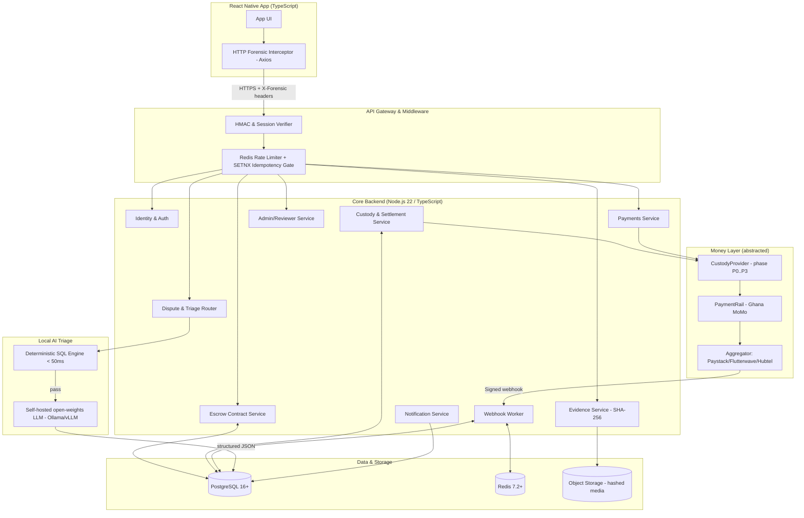

# Croe — System Architecture (`04-Architecture.md`)

> Terms per [`26-Glossary.md`](26-Glossary.md). This doc defines the service boundaries and the two provider abstractions (`CustodyProvider`, `PaymentRail`) consumed by [`12`](06-Money-Custody-and-Settlement.md), [`22`](10-Payments-Collection.md), and [`23`](11-Payouts-Refunds.md). Method names here are canonical — reuse them verbatim.

## 1. Architectural Principles

1. **Zero-trust client ingestion** — never trust request bodies for security metadata; capture device id, IP, timestamps via middleware from headers.
2. **Fail-fast deterministic security** — run sub-second SQL heuristics before spending compute (LLM) or human time.
3. **Database-enforced ACID isolation** — push race prevention into PostgreSQL row locks (`SELECT FOR UPDATE`) + partial unique indexes.
4. **Immutable forensic ledger** — separate cached UI status (`escrow_transactions`) from the append-only audit trail (`transaction_ledger`).
5. **Provider abstraction** — all money movement and custody go through `CustodyProvider` / `PaymentRail`; escrow logic is custody-phase- and country-agnostic.

## 2. High-Level System Diagram



## 3. Service Boundaries

Each service owns one responsibility and its tables; they communicate via well-defined calls.

| Service | Responsibility | Primary tables | Spec |
| :--- | :--- | :--- | :--- |
| Identity & Auth | phone-OTP signup/login, sessions, device binding | `users`, `auth_sessions`, `otp_challenges` | [`20`](08-Identity-Auth.md) |
| KYC/AML | tiered verification, limits, screening | `kyc_records` | [`21`](09-KYC-and-AML.md) |
| Escrow | contract lifecycle, state transitions | `escrow_transactions`, `transaction_ledger` | [`13`](07-Escrow-Lifecycle.md) |
| Custody & Settlement | pooled float, sub-ledger, reconciliation | `custody_accounts`, `transaction_ledger` | [`12`](06-Money-Custody-and-Settlement.md) |
| Payments | deposits (collection), payouts/refunds (disbursement) | `payouts`, `webhook_inbox` | [`22`](10-Payments-Collection.md), [`23`](11-Payouts-Refunds.md) |
| Evidence | media upload, SHA-256, forensic capture | `evidence_artifacts` | [`26`](14-Evidence-and-Forensics.md) |
| Dispute & Triage | heuristics + LLM + human routing | `dispute_cases` | [`25`](13-Disputes-and-AI-Triage.md) |
| Notifications | push/SMS per event | `notifications` | [`27`](15-Notifications.md) |
| Admin/Reviewer | L3 queue & adjudication | (reads all) | [`28`](16-Admin-Console.md) |
| Webhook Worker | verify + idempotent ingest of aggregator callbacks | `webhook_inbox`, `idempotency_keys` | [`24`](12-Webhooks-and-Idempotency.md) |

## 4. The `CustodyProvider` Abstraction

The escrow/payment services call **only** this interface; the concrete implementation depends on the custody phase (P0 sandbox, P1 aggregator-settlement, P2 partner-trust). Amounts are decimal **strings**, never JS floats.

```typescript
type Currency = 'GHS' | 'NGN' | 'KES';
interface Money { amount: string; currency: Currency; } // e.g. { amount: "450.00", currency: "GHS" }

interface CustodyProvider {
  /** P: all. Begin collecting funds from a buyer into the pool. Returns a pending reference; confirmation arrives via webhook. */
  collect(p: { transactionId: string; buyerMsisdn: string; amount: Money; rail: PaymentRail }): Promise<{ collectionRef: string; status: 'PENDING' }>;

  /** P: all. Earmark confirmed funds to a transaction in the sub-ledger. Idempotent; enforced by single-deposit partial unique index. */
  hold(transactionId: string, amount: Money): Promise<void>;

  /** P: all. Disburse held funds to the vendor (release), net of commission. */
  releaseTo(p: { transactionId: string; vendorMsisdn: string; amount: Money; commission: Money }): Promise<DisbursementResult>;

  /** P: all. Disburse held funds back to the buyer (refund). No commission. */
  refundTo(p: { transactionId: string; buyerMsisdn: string; amount: Money }): Promise<DisbursementResult>;

  /** P: all. Current pooled balance for a currency (for reconciliation). */
  getBalance(currency: Currency): Promise<Money>;

  /** P: all. Reconcile pooled balance vs sub-ledger vs partner/aggregator statement over a window. */
  reconcile(window: { from: string; to: string }): Promise<ReconciliationReport>;
}

interface DisbursementResult { payoutId: string; status: 'INITIATED' | 'SUCCESS' | 'FAILED'; providerRef?: string; failureReason?: string; }
interface ReconciliationReport { pooled: Money; subLedgerSum: Money; statementSum: Money; matched: boolean; discrepancies: Array<{ transactionId?: string; note: string; delta: Money }>; }
```

Behavior of each method per phase is specified in [`06-Money-Custody-and-Settlement.md`](06-Money-Custody-and-Settlement.md).

## 5. The `PaymentRail` Abstraction

The physical money-movement mechanism for a country/network. `CustodyProvider` uses a `PaymentRail` to execute MoMo operations. Ghana/MoMo (via aggregator) is the first implementation.

```typescript
interface PaymentRail {
  /** Trigger a carrier USSD push prompt on the buyer's handset. */
  initiateDeposit(p: { transactionId: string; msisdn: string; amount: Money; carrier: 'MTN' | 'TELECEL' | 'AIRTELTIGO' }): Promise<{ providerRef: string }>;

  /** Verify an inbound webhook's HMAC signature over the raw buffer (see 24). */
  verifyWebhook(rawBody: Buffer, headers: Record<string, string>): boolean;

  /** Normalize a verified webhook payload into a rail-agnostic event. */
  parseWebhook(payload: unknown): { providerRef: string; transactionId: string; outcome: 'PAID' | 'FAILED' | 'CANCELLED'; amount: Money };

  /** Execute a B2C disbursement to a wallet. */
  initiateDisbursement(p: { msisdn: string; amount: Money; reference: string }): Promise<{ providerRef: string; status: 'INITIATED' | 'FAILED' }>;
}
```

## 6. Concurrency & Double-Spend Engine

When a MoMo webhook arrives, three layered gates prevent double-funding (full detail + code in [`12-Webhooks-and-Idempotency.md`](12-Webhooks-and-Idempotency.md)):

```mermaid
sequenceDiagram
    participant Agg as Aggregator
    participant API as Webhook Worker
    participant Redis
    participant PG as PostgreSQL
    Agg->>API: POST webhook (signature, timestamp)
    API->>API: Verify HMAC over rawBody + replay window (<300s)
    API->>Redis: SETNX idemp:<ref> (24h TTL)
    alt duplicate
        Redis-->>API: 0
        API-->>Agg: 200 OK (short-circuit)
    else new
        API-->>Agg: 200 OK (<500ms)
        API->>PG: BEGIN; SELECT ... FOR UPDATE (row lock)
        alt already FUNDS_SECURED
            API->>PG: ROLLBACK
        else safe
            API->>PG: INSERT ledger FUNDS_DEPOSITED (partial unique index)
            API->>PG: UPDATE escrow_transactions -> FUNDS_SECURED
            API->>PG: COMMIT
        end
    end
```

Gate 1 = Redis `SETNX` (fast dedup) + durable `webhook_inbox`. Gate 2 = `SELECT FOR UPDATE` row lock. Gate 3 = partial unique index `idx_single_deposit_per_transaction` (structural backstop; error `23505` treated as safe duplicate).

## 7. Global-vs-Ghana Mapping

- **Country-agnostic:** escrow service, custody sub-ledger logic, dispute pipeline, identity, notifications.
- **Country-specific (behind abstractions):** `PaymentRail` (Ghana MoMo now; Kenya M-Pesa / Nigeria later), `CustodyProvider` concrete (which licensed partner), currency, KYC identifiers, regulatory thresholds.
- Adding a market = new `PaymentRail` + `CustodyProvider` impl + a custody-phase evaluation ([`02-Market-and-Regulatory.md`](02-Market-and-Regulatory.md)); zero changes to escrow/dispute logic.
