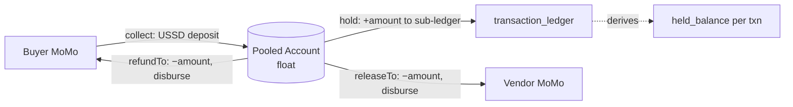

# Croe — Money, Custody & Settlement (`06-Money-Custody-and-Settlement.md`)

> The backbone that makes escrow legal and correct. Uses the `CustodyProvider` interface from [`04-Architecture.md`](04-Architecture.md) §4 and the `transaction_ledger` sub-ledger from [`05-Data-Model.md`](05-Data-Model.md) §5. Custody phases P0–P3 per [`26-Glossary.md`](26-Glossary.md).

## 1. The Core Idea: Pooled Account + Sub-Ledger

Croe never keeps a separate bank account per transaction. Instead:

- **One pooled account per currency** holds the entire **float** (all in-escrow money). Whose account it is depends on the custody phase (aggregator settlement in P1, partner trust account in P2).
- **`transaction_ledger` is the authoritative sub-ledger.** The amount belonging to any transaction at any instant is `SUM(amount_delta)` for that `transaction_id`. This is why the ledger is append-only and forensic — it is literally the accounting record of who owns what inside the pool.

**Invariant (I1):** `pooled_account_balance(currency) == Σ held_balance(transaction) for that currency`, at all times, ignoring in-flight disbursements. Verified daily by reconciliation ([`42`](23-Observability-and-Reconciliation.md)).

## 2. Money Flow

1. **Collect** (`collect`): buyer pays via USSD; funds land in the pooled account. Status pending until the aggregator webhook confirms.
2. **Hold** (`hold`): on confirmed webhook, append `FUNDS_DEPOSITED` with `amount_delta = +amount`. The partial unique index guarantees exactly one deposit per transaction. Transaction → `FUNDS_SECURED`.
3. **Release** (`releaseTo`): on `DELIVERED_CONFIRMED` or `RELEASE_VENDOR`, disburse `amount − commission` to the vendor; append `FUNDS_RELEASED` with `amount_delta = −amount`. Record a `payouts` row (`direction=RELEASE`).
4. **Refund** (`refundTo`): on `REFUND_BUYER`, disburse `amount` to the buyer; append `REFUND_ISSUED` with `amount_delta = −amount`. Record a `payouts` row (`direction=REFUND`).

**Commission** stays in the pool as Croe revenue and is swept separately (a scheduled Croe-revenue disbursement, tracked outside the per-transaction sub-ledger). Commission is `NUMERIC(15,2)`; `amount_delta` on release is the full `amount` (the vendor gets `amount − commission`, the `commission` remains as Croe's).

## 3. `CustodyProvider` Behavior Per Phase

| Method | P0 Sandbox | P1 Aggregator-live | P2 Partner-held |
| :--- | :--- | :--- | :--- |
| `collect` | Aggregator **test** USSD; fake funds | Aggregator live USSD → Croe settlement account | Aggregator live USSD → partner trust account |
| `hold` | Ledger write only | Ledger write; float in settlement acct | Ledger write; float in partner trust acct |
| `releaseTo` | Simulated payout | Aggregator B2C payout from settlement | Partner-instructed payout from trust acct |
| `refundTo` | Simulated | Aggregator B2C refund | Partner-instructed refund |
| `getBalance` | Local tally | Aggregator balance API | Partner statement/API |
| `reconcile` | No-op / self-consistent | Ledger vs aggregator statement | Ledger vs partner statement |

The concrete class is selected by config (`CUSTODY_PHASE` env). Escrow/payment services are unaware which is active.

## 4. Reconciliation

A daily job (detailed in [`23-Observability-and-Reconciliation.md`](23-Observability-and-Reconciliation.md)) computes a `ReconciliationReport`:

- `pooled` = `getBalance(currency)` from the provider.
- `subLedgerSum` = `SELECT SUM(amount_delta) FROM transaction_ledger WHERE currency=$1` (equivalently, sum of all held balances).
- `statementSum` = total from the partner/aggregator statement for the window.
- `matched` = all three equal within a defined tolerance (ideally exactly zero).
- `discrepancies` = per-transaction deltas when they don't match.

**Any mismatch is a P1 incident** — freeze new disbursements for the affected currency and alert. Runbook in [`42`](23-Observability-and-Reconciliation.md).

## 5. Failure Modes

| Failure | Handling |
| :--- | :--- |
| **Deposit webhook lost** | Aggregator retries; `webhook_inbox` dedups; a reconciliation sweep catches settled-but-unheld funds and completes the `hold`. |
| **Partial/failed payout** | `payouts.status = FAILED` + ledger `PAYOUT_FAILED`; sub-ledger `amount_delta` for release is written **only on payout success**, so a failed payout leaves the balance intact and retriable. |
| **Double release attempt** | `idx_single_success_payout` blocks a second successful payout per `(transaction_id, direction)`. |
| **Stuck float** (held but no resolution) | Auto-release timer ([`13`](07-Escrow-Lifecycle.md)); reconciliation flags long-held balances. |
| **Currency mismatch** | Rejected at write; no cross-currency `amount_delta`. |

## 6. Ordering Rule (critical)

Disbursement and ledger write must be transactionally consistent: **initiate payout → on provider `SUCCESS`, within one DB transaction append the `−amount` ledger event and mark the `payouts` row `SUCCESS`.** Never write the `−amount` ledger event before the payout provider confirms success, or the sub-ledger will under-count the float. (Enforced as a rule in [`25-Engineering-Rules.md`](25-Engineering-Rules.md).)
