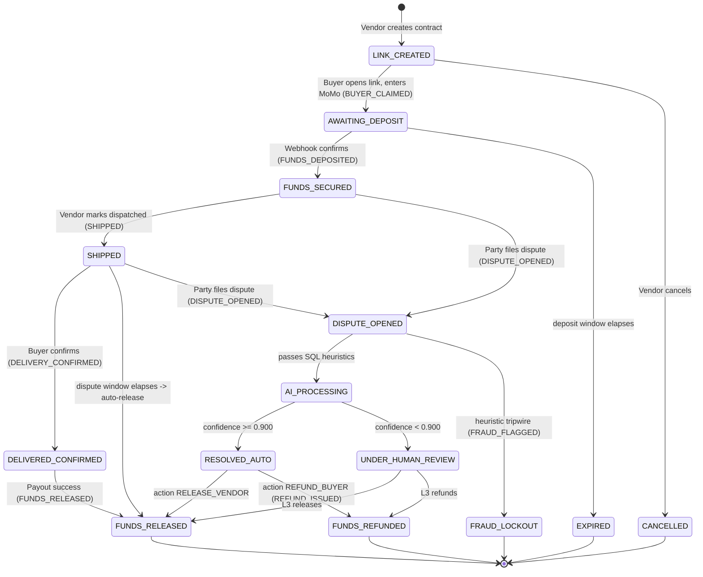
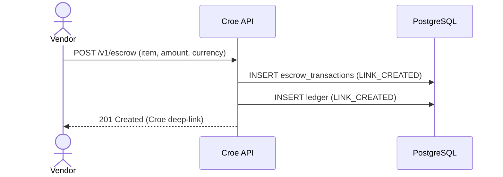

# Croe — Escrow Lifecycle & State Machine (`07-Escrow-Lifecycle.md`)

> Uses ONLY the canonical states and ledger events from [`26-Glossary.md`](26-Glossary.md). Every transition names its ledger event, custody action, and notification. Enforced by the `CHECK` constraints in [`05-Data-Model.md`](05-Data-Model.md).

## 1. State Machine

## 2. Transition Table

| From | Event / trigger | Guard | To | Ledger event | Custody action | Notify |
| :--- | :--- | :--- | :--- | :--- | :--- | :--- |
| `LINK_CREATED` | Buyer opens link | valid link | `AWAITING_DEPOSIT` | `BUYER_CLAIMED` | — | — |
| `LINK_CREATED` | Vendor cancels | vendor owns it | `CANCELLED` | — | — | vendor |
| `AWAITING_DEPOSIT` | Webhook `PAID` | HMAC valid, not already secured | `FUNDS_SECURED` | `FUNDS_DEPOSITED` (+amount) | `hold` | both |
| `AWAITING_DEPOSIT` | timer | `now > deposit_expires_at` | `EXPIRED` | — | — | both |
| `FUNDS_SECURED` | Vendor ships | KYC ok | `SHIPPED` | `SHIPPED` | — | buyer |
| `SHIPPED` | Buyer confirms | buyer owns it | `DELIVERED_CONFIRMED` | `DELIVERY_CONFIRMED` | — | vendor |
| `DELIVERED_CONFIRMED` | payout success | idempotent | `FUNDS_RELEASED` | `FUNDS_RELEASED` (−amount) | `releaseTo` | both |
| `SHIPPED` | timer | `now > dispute_closes_at`, no dispute | `FUNDS_RELEASED` | `FUNDS_RELEASED` (−amount) | `releaseTo` | both |
| `FUNDS_SECURED`/`SHIPPED` | Party disputes | within window | `DISPUTE_OPENED` | `DISPUTE_OPENED` | — | both |
| `DISPUTE_OPENED` | heuristics pass | — | `AI_PROCESSING` | — | — | — |
| `DISPUTE_OPENED` | heuristic trips | recycled/Sybil/burner | `FRAUD_LOCKOUT` | `FRAUD_FLAGGED` | — | offender |
| `AI_PROCESSING` | AI result | `confidence ≥ 0.900` | `RESOLVED_AUTO` | — | — | — |
| `AI_PROCESSING` | AI result | `confidence < 0.900` | `UNDER_HUMAN_REVIEW` | — | — | both |
| `RESOLVED_AUTO`/`UNDER_HUMAN_REVIEW` | resolution = release | payout success | `FUNDS_RELEASED` | `FUNDS_RELEASED` (−amount) | `releaseTo` | both |
| `RESOLVED_AUTO`/`UNDER_HUMAN_REVIEW` | resolution = refund | payout success | `FUNDS_REFUNDED` | `REFUND_ISSUED` (−amount) | `refundTo` | both |

**Guards enforced in code + DB:** money mutations require `SELECT FOR UPDATE` on the row ([`24`](12-Webhooks-and-Idempotency.md)); the `−amount` ledger event is written only after payout provider `SUCCESS` ([`12`](06-Money-Custody-and-Settlement.md) §6).

## 3. Timeouts & Timers

| Timer | Default | Set when | Fires |
| :--- | :--- | :--- | :--- |
| **Deposit window** | 24h **[verify/decide]** | `LINK_CREATED` → sets `deposit_expires_at` | `AWAITING_DEPOSIT` → `EXPIRED` |
| **Dispute window / auto-release** | 24h post-`SHIPPED` **[verify/decide]** | `SHIPPED` → sets `dispute_closes_at` | `SHIPPED` → `FUNDS_RELEASED` if no dispute |

A scheduled worker scans for elapsed timers (indexed on the deadline columns) and drives the transition idempotently. Auto-release respects the same payout ordering rule as manual release.

## 4. Terminal States

`FUNDS_RELEASED`, `FUNDS_REFUNDED`, `FRAUD_LOCKOUT`, `EXPIRED`, `CANCELLED`. No transitions leave a terminal state; a new transaction is required.

## 5. Key Sequence Flows

### 5.1 Link creation

### 5.2 Deposit → secure (concurrency-safe)
See [`12-Webhooks-and-Idempotency.md`](12-Webhooks-and-Idempotency.md) for the full webhook/lock sequence; net effect: `AWAITING_DEPOSIT` → `FUNDS_SECURED` with a single `FUNDS_DEPOSITED` event.

### 5.3 Dispute triage
See [`13-Disputes-and-AI-Triage.md`](13-Disputes-and-AI-Triage.md); net effect: `DISPUTE_OPENED` → (`FRAUD_LOCKOUT` | `RESOLVED_AUTO` | `UNDER_HUMAN_REVIEW`) → terminal.

## 6. Consistency Checks (for the implementer)

- Every `current_status` value appears in this machine and in the [`11`](05-Data-Model.md) `CHECK`.
- Every money transition has a matching `payouts` row and a `±amount` ledger event.
- No transition writes a state outside [`26-Glossary.md`](26-Glossary.md).
