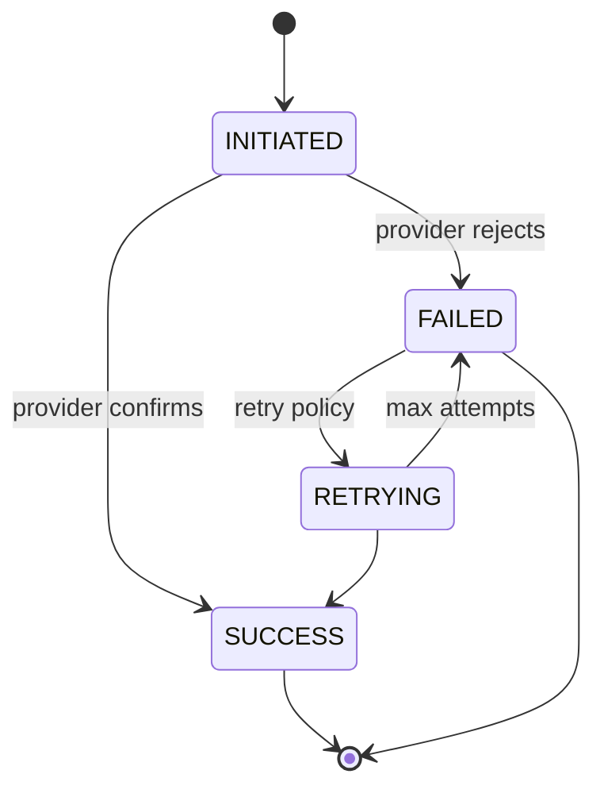

# Croe — Payouts & Refunds (Disbursements) (`11-Payouts-Refunds.md`)

> Uses `CustodyProvider.releaseTo()` / `refundTo()` and the `payouts` table ([`05-Data-Model.md`](05-Data-Model.md)). Obeys the payout-ordering rule in [`12`](06-Money-Custody-and-Settlement.md) §6. Custody phase: P0/P1/P2.

## 1. Purpose & Boundaries

Move funds **out** of escrow — to the vendor (release) or back to the buyer (refund) — safely, idempotently, and with correct sub-ledger accounting. **Does not** decide *whether* to release/refund (that's the lifecycle [`13`](07-Escrow-Lifecycle.md) / dispute [`25`](13-Disputes-and-AI-Triage.md)).

## 2. Release (vendor payout)

Triggered by `DELIVERED_CONFIRMED`, auto-release timer, or a dispute resolution `RELEASE_VENDOR`.

- Compute `commission = round(amount * rate, 2)` (`NUMERIC(15,2)`); vendor receives `amount − commission`.
- Insert `payouts` row (`direction=RELEASE`, `INITIATED`).
- Call `releaseTo({transactionId, vendorMsisdn, amount, commission})`.
- **On provider `SUCCESS` only**, within one DB transaction: mark `payouts.SUCCESS`, append ledger `FUNDS_RELEASED` (`amount_delta = −amount`), set `FUNDS_RELEASED`.
- Commission remains in the pool as Croe revenue (swept separately, [`12`](06-Money-Custody-and-Settlement.md) §2).

## 3. Refund (buyer)

Triggered by a dispute resolution `REFUND_BUYER` (auto or L3).

- Insert `payouts` row (`direction=REFUND`, `INITIATED`).
- Call `refundTo({transactionId, buyerMsisdn, amount})` (no commission).
- **On `SUCCESS` only:** mark `payouts.SUCCESS`, append ledger `REFUND_ISSUED` (`amount_delta = −amount`), set `FUNDS_REFUNDED`.

## 4. Payout State Machine

## 5. Error & Edge Cases

| Case | Handling |
| :--- | :--- |
| Payout provider rejects (invalid wallet) | `payouts.FAILED` + ledger `PAYOUT_FAILED`; **no `−amount` ledger event** (float intact); notify + surface to L3 for corrected MSISDN. |
| Transient provider error | Retry with backoff up to max attempts (`RETRYING`); idempotent via `payouts.provider_ref`. |
| Insufficient pooled float | Block; P1 incident (reconciliation mismatch — [`42`](23-Observability-and-Reconciliation.md)); never partial-pay. |
| Double release attempt | `idx_single_success_payout` blocks a 2nd `SUCCESS` per `(transaction_id, direction)`. |
| Duplicate resolution triggers | `Idempotency-Key` + existing terminal state → no-op. |
| Reversal needed after success | Not automatic; manual L3 action with full audit (funds already left the pool). |

## 6. Idempotency & Ordering (must-follow)

- The `−amount` ledger event and `payouts.SUCCESS` are written **only after** the provider confirms success, in the **same** DB transaction (payout-ordering rule, [`12`](06-Money-Custody-and-Settlement.md) §6).
- Every disbursement path requires an `Idempotency-Key`; replays return the original result.
- Failed payouts never mutate the sub-ledger, so the transaction remains cleanly retriable.

## 7. Acceptance Criteria

- No float leaves the pool without a corresponding `−amount` ledger event and a `SUCCESS` `payouts` row.
- A failed payout leaves the transaction's held balance unchanged and retriable.
- Never more than one successful payout per direction per transaction.
- Commission math uses `NUMERIC(15,2)`; vendor net + commission == amount, exactly.
