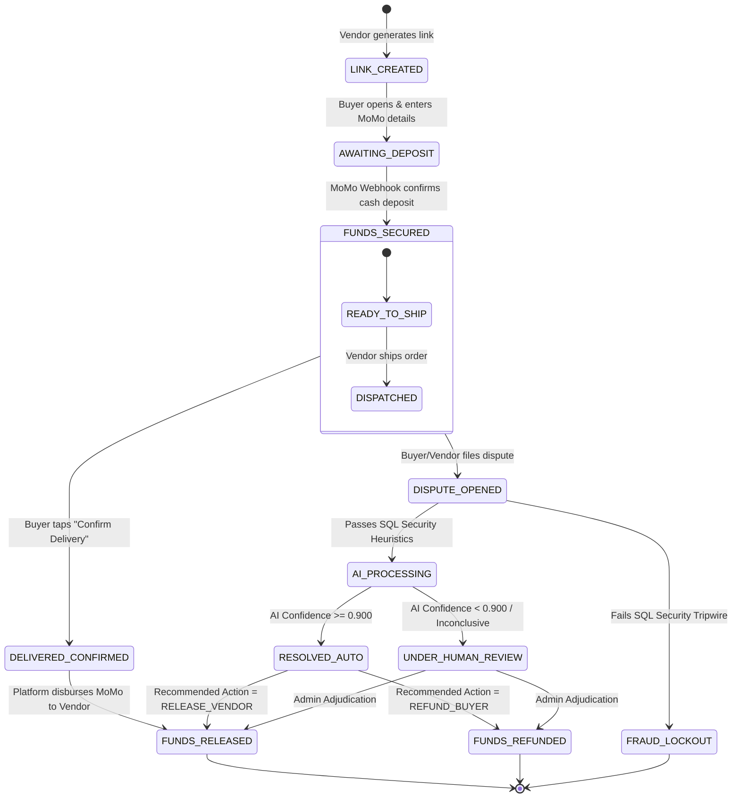
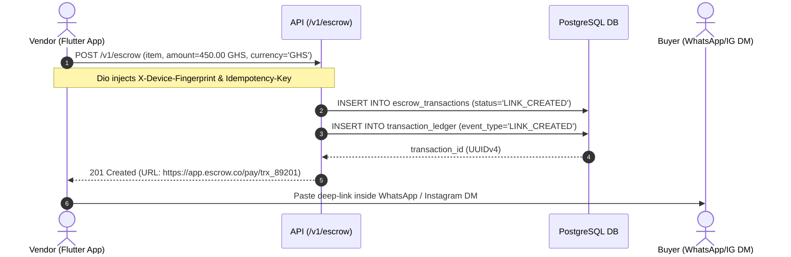
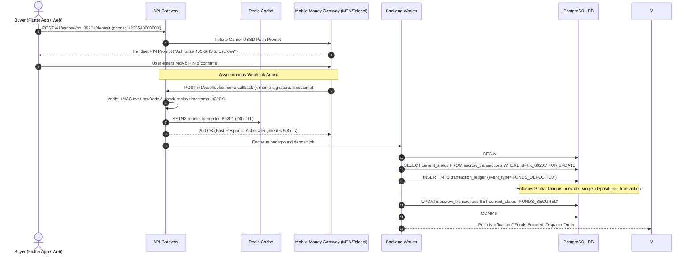
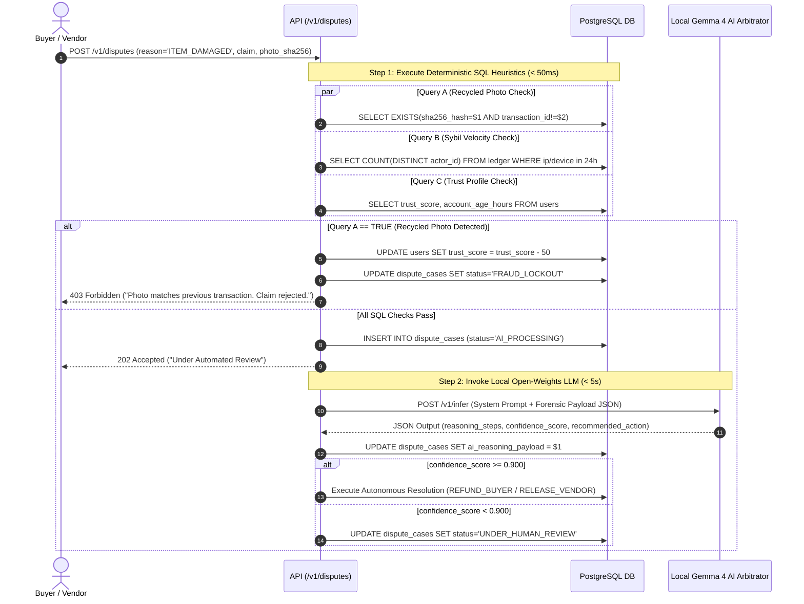

# Social Commerce Escrow Platform — Application State Machine & User Flows (AppFlow.md)

## 1. Escrow Contract Lifecycle State Machine
Every escrow transaction progresses through strict, mathematically verifiable states. State transitions are governed by PostgreSQL ACID transactions and recorded in `transaction_ledger`.

---

## 2. Detailed Sequence Flows

### 2.1 Flow 1: Escrow Link Creation & Social DM Handshake

---

### 2.2 Flow 2: Mobile Money Deposit & Concurrency-Safe Escrow Locking

---

### 2.3 Flow 3: Sub-Second Heuristic Tripwire & Local AI Dispute Triage

