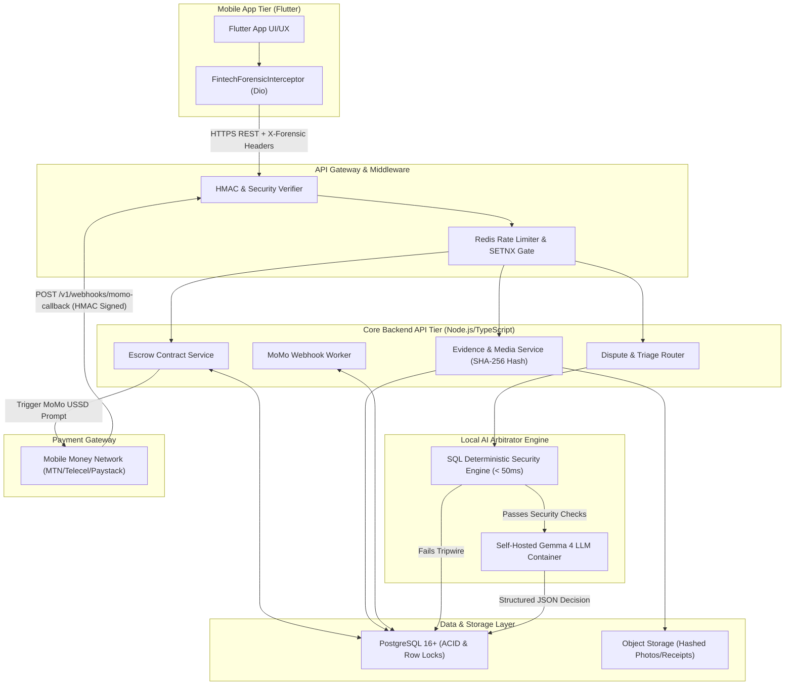
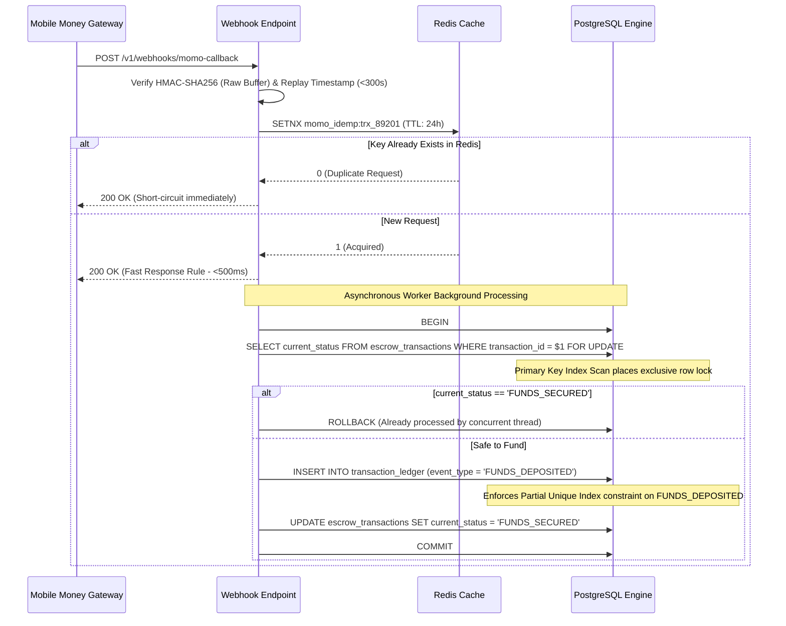

# Social Commerce Escrow Platform — System Architecture Blueprint (Architecture.md)

## 1. Architectural Principles
1. **Zero-Trust Client Ingestion**: Never trust client request bodies for security metadata. Capture device hardware IDs, IP addresses, and timestamps via middleware header injection.
2. **Fail-Fast Deterministic Security**: Execute lightweight, sub-second SQL heuristic checks before allocating expensive compute or human review.
3. **Database-Enforced ACID Isolation**: Push race-condition prevention down to PostgreSQL row-level locks (`SELECT FOR UPDATE`) and structural partial unique indexes.
4. **Immutable Forensic Ledgers**: Separate current UI status caching (`escrow_transactions`) from historical audit logs (`transaction_ledger`).

---

## 2. High-Level System Architecture Diagram



---

## 3. Subsystem Architectural Deep Dives

### 3.1 The Concurrency & Double-Spend Defense Engine
When asynchronous Mobile Money payment webhooks hit the backend, network retries or duplicate callbacks create severe double-spend hazards. The backend enforces three layered gates:



### 3.2 Automated Forensic & Triage Architecture
When a dispute is initiated (`POST /v1/disputes`), the backend avoids invoking the LLM until deterministic SQL checks pass:

```
+-----------------------------------------------------------------------------------+
|                        DISPUTE INITIATION (POST /v1/disputes)                     |
+-----------------------------------------------------------------------------------+
                                         |
                                         v
+-----------------------------------------------------------------------------------+
|                   STEP 1: DETERMINISTIC SQL HEURISTICS (< 50ms)                   |
|                                                                                   |
|  Query A: SELECT EXISTS (sha256_hash = $1 AND transaction_id != $2)               |
|  Query B: SELECT COUNT(DISTINCT actor_id) FROM ledger WHERE ip/device in 24h      |
|  Query C: SELECT trust_score, account_age_hours FROM users WHERE user_id = $1     |
+-----------------------------------------------------------------------------------+
                                         |
         +-------------------------------+-------------------------------+
         | (Tripped Fraud Rule)                                          | (All Passed)
         v                                                               v
+-----------------------------------+               +-------------------------------+
|     INSTANT SECURITY LOCKOUT      |               | STEP 2: GEMMA 4 LOCAL INFER   |
| - Ban / Freeze Device ID          |               | - Build prompt from artifacts |
| - Deduct -50 Trust Score          |               | - Parse JSON reasoning        |
| - Auto-resolve against bad actor  |               +-------------------------------+
+-----------------------------------+                                |
                                            +------------------------+------------------------+
                                            | (Confidence >= 0.90)                            | (Confidence < 0.90)
                                            v                                                 v
                              +---------------------------+                     +---------------------------+
                              |   AUTONOMOUS EXECUTION    |                     |    HUMAN REVIEW QUEUE     |
                              | - Smart Contract Payout   |                     | - Route to Admin Panel    |
                              | - Notify users via Push   |                     | - Attach AI Payload JSON  |
                              +---------------------------+                     +---------------------------+
```

---

## 4. API Domain Segmentation
The REST API is organized into four clean domains:
1. **`/v1/escrow`**: Lifecycle management (create contract, query status, trigger deposit, confirm delivery).
2. **`/v1/evidence`**: Media upload with on-the-fly SHA-256 computation and secure S3/R2 storage.
3. **`/v1/disputes`**: Dispute submission, status polling, and AI triage payload management.
4. **`/v1/webhooks`**: Cryptographically hardened callback receivers for Mobile Money gateways.
