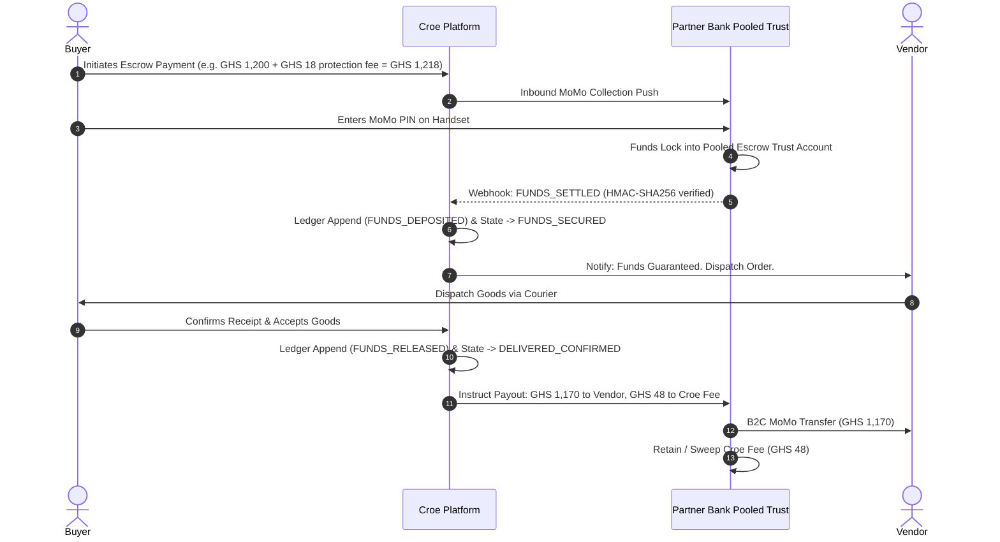

# Croe - Banking Partner & Custody Brief

> **Institutional Due-Diligence & Partnership Document.**  
> Prepared for Licensed Commercial Banks, Dedicated Electronic Money Issuers (DEMIs), Enhanced Payment Service Providers (EPSPs), and Regulatory Compliance Evaluators.

---

## 1. Executive Summary

Croe is an escrow and transaction orchestration infrastructure built for emerging-market social commerce (WhatsApp, Instagram, and TikTok), launching Ghana-first on Mobile Money rails.

### The Institutional Opportunity
In traditional social commerce, billions of Ghana Cedis circulate through informal peer-to-peer (P2P) MoMo transfers between strangers with high fraud rates and zero institutional custody. Croe captures this high-velocity commerce flow and locks it inside a **licensed partner trust account** until goods are confirmed delivered.

| What Croe Delivers to the Banking Partner | What Croe Requires from the Partner |
| :--- | :--- |
| **Sticky Non-Interest Bearing Float:** Growing pool of escrow deposit float sitting in the partner's pooled trust account (CASA deposits). | A dedicated **pooled escrow trust account** with sub-accounting or API-driven disbursement capabilities. |
| **New Transaction Fee Revenue:** Transactional volume fees on inbound collections and B2C Mobile Money disbursements. | Sponsorship / affiliation under the partner's BoG licence framework (Act 987). |
| **Enterprise-Grade Fraud Defense:** Cryptographic forensic tracking, SHA-256 evidence hashing, and automated AML tripwires. | Daily MT940 / automated electronic account statements for automated three-way reconciliation. |

---

## 2. Regulatory & Legal Posture: The Non-Custodial Tech Provider

### The Core Principle
**Croe is a software and orchestration provider. Croe is not a bank, does not issue electronic money, and never holds customer funds on its own corporate balance sheet.**

Under the **Payment Systems and Services Act, 2019 (Act 987)** of Ghana, holding third-party funds requires appropriate licensing by the Bank of Ghana (BoG). Croe achieves total regulatory compliance via a **Phased Custody Architecture**:

```
[ P0: Sandbox ] ──────> [ P1: Supervised Pilot ] ──────> [ P2: Licensed Partner Trust ]
  Mock accounts            Aggregator Settlement            Partner Bank Pooled Trust
  Zero real funds          Strict volume caps (<100 txn)   Full Compliant Scale
```

* **Phase P1 (Interim Supervised Pilot):** Low-volume, supervised transactions settled via our licensed payment aggregator's merchant settlement account under strict limits and explicit user disclosure.
* **Phase P2 (Institutional Target - The Subject of This Brief):** Migration to a **licensed commercial bank or EPSP/DEMI partner** where client funds reside in a dedicated **pooled trust account held for the benefit of Croe users**.
* **Regulatory Classification:** Croe registers as a **Payment Financial Technology Service Provider (PFTSP)** or operates under the regulatory umbrella of the licensed custodial partner.

---

## 3. Financial Infrastructure & Double-Spend Defense

Croe's financial backend is architected to institutional banking standards:

### 3.1 Absolute Money Precision (Rule FIN-01)
Floating-point arithmetic is strictly prohibited across the entire stack. Every monetary amount in the system is represented as exact `NUMERIC(15,2)` in PostgreSQL and fixed-point decimal strings in TypeScript.

### 3.2 Append-Only Financial Sub-Ledger (Rule AUD-01)
All balance movements are recorded in an append-only `transaction_ledger`. At the database role level, `UPDATE` and `DELETE` grants are permanently revoked. Balance history is immutable, cryptographically verifiable, and serves as an authoritative audit trail for who owns what fraction of the pooled float.

### 3.3 Three-Layer Double-Spend Defense
1. **Redis Distributed Fast Gate:** `SETNX idemp:<provider_ref>` with a 24-hour TTL guarantees instantaneous short-circuiting of duplicate webhook deliveries.
2. **Pessimistic Database Row Locking (`SELECT ... FOR UPDATE`):** Every state mutation explicitly acquires an exclusive row lock on the transaction, serializing concurrent events and preventing race conditions.
3. **Structural Backstop (Partial Unique Indexes):** PostgreSQL partial unique indexes (`idx_single_deposit_per_transaction`, `idx_single_release_payout`) guarantee that multiple deposits or payouts for the same order produce database constraint violations (Error `23505`), which are safely intercepted.

---

## 4. Custody & Money Flow Architecture

The escrow lifecycle is decoupled from physical money rails via our `CustodyProvider` interface:



**Key Safeguards for the Partner Bank:**
* **Pay First, Then Ledger (Rule MONEY-01):** The negative ledger balance is only recorded after the partner/rail confirms external disbursement success. A failed disbursement leaves the ledger balance intact and retriable.
* **Separation of Float and Commission:** Customer float and platform revenue are mathematically isolated in the ledger. Commission is swept weekly in dedicated, audited reconciliation batches.

---

## 5. KYC, AML & Regulatory Compliance Controls

Croe operates a rigorous, proportionate compliance framework complying with the **Anti-Money Laundering Act, 2020 (Act 1044)**:

| KYC Tier | Verification Requirement | Per-Transaction Cap | Daily Velocity Limit | Customer Type |
| :--- | :--- | :--- | :--- | :--- |
| **Tier 0** | Verified Mobile Number (MoMo OTP) | GHS 500.00 | GHS 1,000.00 | First-time buyers |
| **Tier 1** | Verified Full Legal Name + Ghana Card / Passport | GHS 5,000.00 | GHS 20,000.00 | Regular buyers & verified vendors |
| **Tier 2** | Enhanced Due Diligence (EDD) + Proof of Business Address | GHS 50,000.00 | GHS 100,000.00 | High-volume merchants |

### Fraud Tripwires & Sanctions Handling
* **Structuring Detection:** Algorithmic flagging for repetitive transactions just below tier limits.
* **Device Fingerprinting:** Ingestion and hashing of `X-Device-Fingerprint`, client IP, and network provider on every financial call.
* **Forensic Evidence SHA-256 Hashing:** All uploaded receipts, item photographs, and waybills are hashed at upload. The system automatically detects and blocks recycled scam photos across unrelated accounts.
* **Financial Intelligence Centre (FIC) Escalation:** Integrated administrative workflows for reporting suspicious transaction reports (STRs).

---

## 6. Daily Three-Way Reconciliation

To ensure zero balance drift, Croe runs an automated daily reconciliation service verifying the three independent sources of truth:

$$\text{Bank Pooled Balance} = \sum (\text{Active Sub-Ledger Escrow Balances}) + \text{Pending Commission Sweep}$$

1. **Source 1:** Bank Partner Escrow Float Account statement balance.
2. **Source 2:** Sum of active, unreleased funds in the immutable `transaction_ledger`.
3. **Source 3:** Gateway aggregator / physical rail settlement logs.

> [!IMPORTANT]
> **Strict Operational Circuit Breaker:** If any reconciliation mismatch occurs ($\Delta > \text{GHS } 0.00$), the system immediately logs a **Priority 1 (P1) incident**, halts automatic disbursement workers, and alerts the engineering and operations teams. Customer disbursements are protected from accidental imbalances.

---

## 7. Commercial & Float Projections for the Partner

Croe is targeting the high-ticket social commerce segment in Ghana (smartphones, consumer electronics, premium streetwear). Projections use a blended average order value (AOV) of **GHS 800.00** (GHS 1,200.00 in the lead vertical) and the volume plan in [`FINANCIAL-MODEL.md`](FINANCIAL-MODEL.md). Average float assumes funds are held 2–3 days between deposit and delivery confirmation.

| Scale Stage | Monthly Completed Transactions | Monthly GMV Processed | Average Daily Float in Partner Bank | Annualized Processing Volume |
| :--- | :--- | :--- | :--- | :--- |
| **Supervised Pilot (month 6)** | 250 txns / mo | GHS 200,000.00 | **GHS 13,000 – 20,000** | GHS 2.4M |
| **Compliant Launch on Partner Rails (month 18)** | 5,000 txns / mo | GHS 4,000,000.00 | **GHS 267,000 – 400,000** | GHS 48.0M |
| **Scale (month 36)** | 30,000 txns / mo | GHS 24,000,000.00 | **GHS 1.6M – 2.4M** | GHS 288.0M |

### Proposed Partnership Agreement Structure
1. **Float Deposit Agreement:** Partner Bank provides the designated client trust account under Bank of Ghana escrow guidelines.
2. **Transactional Revenue Sharing:** Competitive interchange / API disbursement pricing per Mobile Money payout.
3. **Sponsorship & Compliance Sign-off:** Joint oversight on KYC thresholds and SAR reporting protocols.

---

## 8. Technical Readiness Summary

* **Codebase Status:** 100% complete across backend and React Native client.
* **Automated Test Suite:** **354 automated tests** passing in CI/CD (including concurrent race conditions, webhook idempotency, precision arithmetic, and state-machine transitions).
* **Architecture Integrity:** `CustodyProvider` interface fully ready to plug into Partner Bank APIs.

**Contact for Institutional & Regulatory Partnerships:**  
Croe Technologies Limited · Accra, Ghana  
**Email:** `partnerships@croe.app` / `legal@croe.app`
